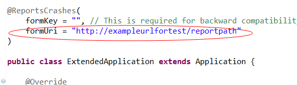
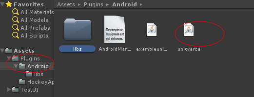
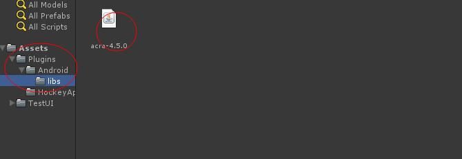
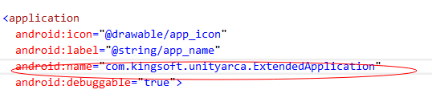

## Introduction

The Unity-ACRA plugin easily lets you keep track of crashes that have been caused by your native Java code by using ACRA.

## Installation & Setup

The following steps illustrate how to integrate the Unity-ACRA plugin:

### 1) Download and build Unity-ARCA
Change the value for **fromeurl** inside the ExtendedApplication.java to the your crash report url.

### 2) Import plugin
Copy the **UnityARCA\bin\unityarca.jar** folder into the **Assets\Plusgings** directory of your Unity project
Unity

### 3) Modify AndroidManifest.xml
add the value for **application\android:name** for  the AndroidManifest.xml (*Assets/Plugins/Android*) to "com.example.unityarca.ExtendedApplication".

